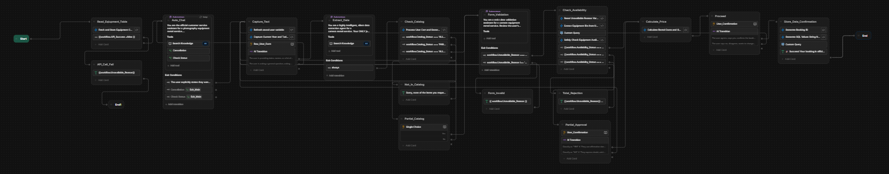
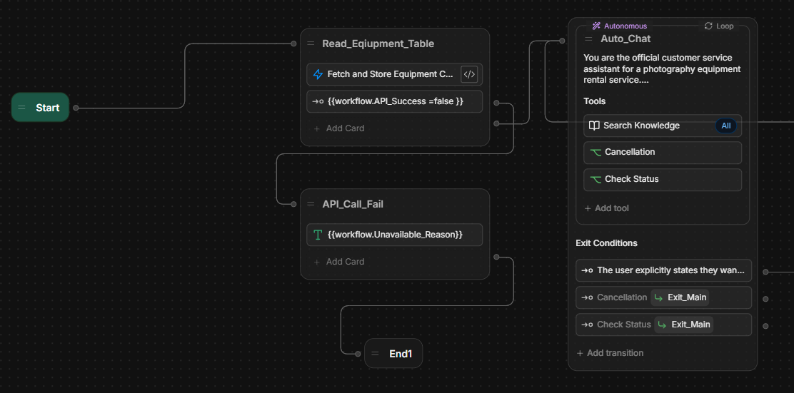
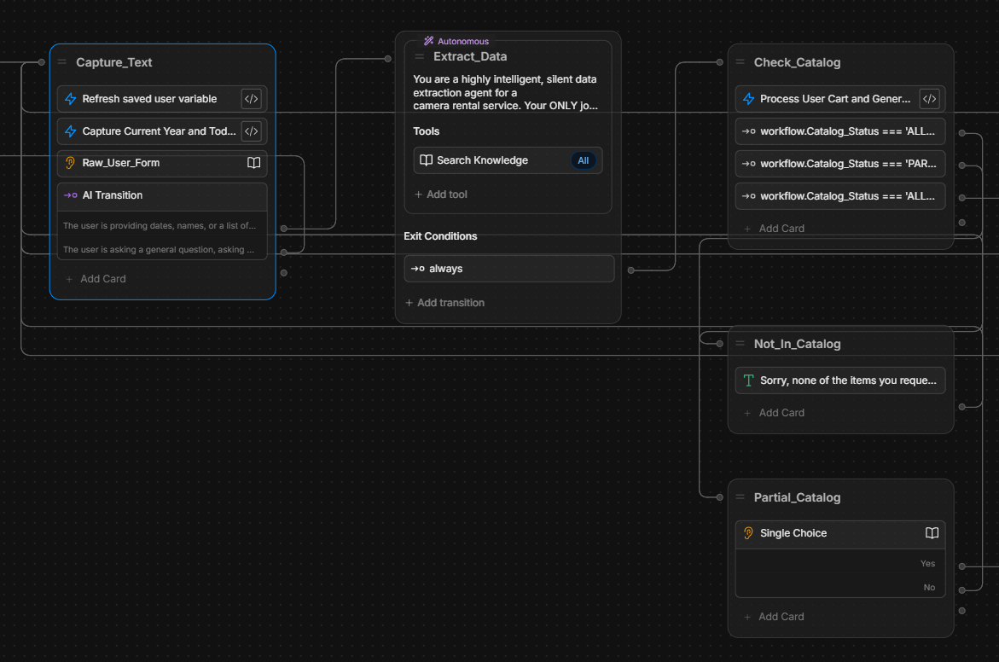
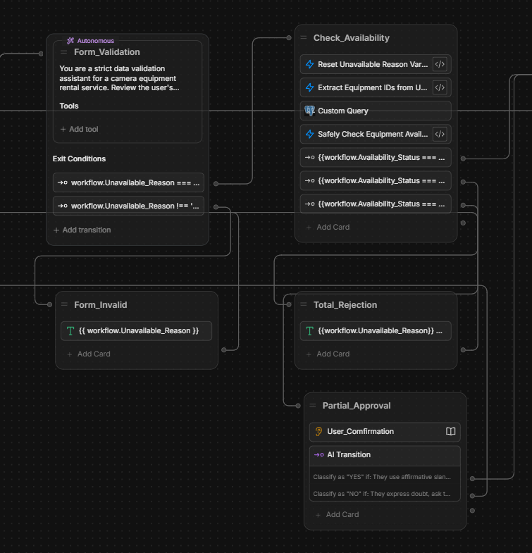
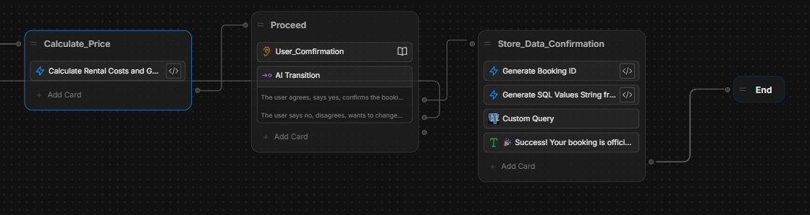
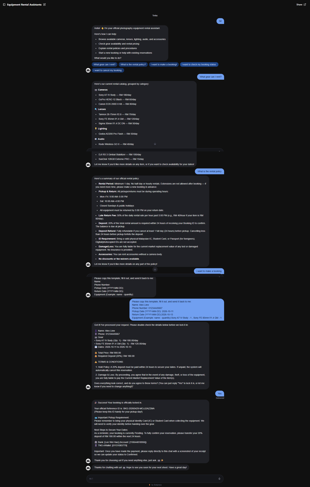

# 📷 Photography Equipment Rental Chatbot

An AI-powered chatbot built with Botpress Cloud that automates 
the full equipment rental process for a photography rental business.

## 🚀 Features
- **Automated Booking** — collects customer details, checks 
  real-time equipment availability, calculates pricing, and 
  generates a unique Booking ID
- **Booking Cancellation** — securely verifies customer identity 
  before cancelling a reservation
- **Booking Status Lookup** — lets customers check their 
  reservation status using their Booking ID
- **Live Database Integration** — connected to Supabase 
  (PostgreSQL) for real-time inventory and booking management
- **AI Form Validation** — uses LLM to validate Malaysian phone 
  numbers, date formats, and customer names
- **Equipment Catalog Cross-check** — automatically detects and 
  handles equipment requests not in the catalog
- **Knowledge Base** — answers FAQs about rental policy, pricing, 
  company details, and contact information
- **Error Handling** — graceful fallbacks for API failures, 
  timeouts, and invalid inputs

## 🛠️ Tech Stack
| Tool | Purpose |
|------|---------|
| Botpress Cloud | Chatbot platform and flow builder |
| GPT-4.1 | AI extraction, validation, and routing |
| Supabase (PostgreSQL) | Live equipment and booking database |
| Axios | REST API calls from execute nodes |

## 📸 Flow Diagram

### Overview

### Section 1 — Entry & Routing

### Section 2 — Booking Form & Extraction  

### Section 3 — Catalog & Form Validation

### Section 4 — Availability & Pricing + Confirmation & Booking

### Chat Demo

## 🗄️ Database Schema
The bot uses two main tables in Supabase:

**equipment** — stores available gear and pricing
**bookings** — stores customer reservations and status
**booking_items** — stores line items for each booking

See `database/schema.sql` for the full schema.

## 📁 Bot Export
The full Botpress bot export is available in `bot-export/`. 
Import it directly into Botpress Cloud to run the bot.

## 🔧 Setup Instructions
1. Import the `.bpz` file into Botpress Cloud
2. Create a Supabase project and run `database/schema.sql`
3. Add your Supabase API key as `db_api` in Botpress 
   environment variables
4. Enable the KnowledgeAgent in the Agents panel
5. Publish the bot

## 👨‍💻 Author
Weihao 
[Your LinkedIn URL]  
[Your Email]

## 📄 License
This project was built as a university assignment and CV project.
